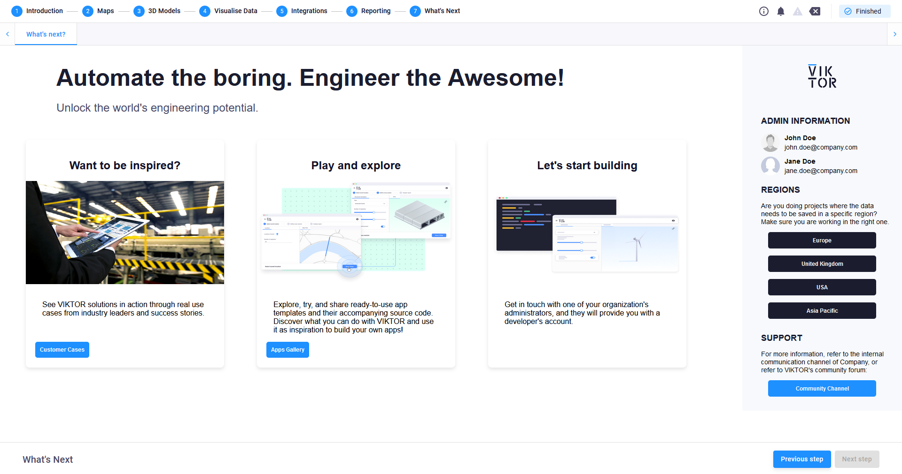

# VIKTOR Introduction app

This application provides an overview of many features and functionalities of the VIKTOR platform, more specifically 
related to app development and usage. The user is guided through the app in an interactive way, by providing input, 
and seeing the results thereof. Features include:
- Map visualizations and interactions
- 3D Geometry visualizations
- Plotting of data
- Examples of engineering analyses
- Presentation of integration possibilities
- Automated reporting
- etc.

The last part of the application presents interesting content and information for developers and users if they want to 
develop or use more of the organizations applications. The project is set up such to make it easy for someone to tailor 
the app to the organization's specifics.

In the following chapter are the steps to change the last step to your organization's content and contacts.

## Info page setup

The final step of the introduction app provides any additional interesting content and contact details for those that 
have interest in this. This can be configured with the organization's own information and content. Here is an image of 
the default page:

To tailor this page to your organization's wishes, change the [info_input.json](info_page/info_input.json) file's 
input with the information of your organization. You can change the following information:

**Company info**
- name
- logo
- primary_color

**Administrator info**
- Name and Surname
- Email
- Profile photo

**Regions**
- Description of why regions are important to the organization
- Name of region
- URL

*If an organization only has one region, keep the region list empty*

**Main page**
- Title
- Subtitle
